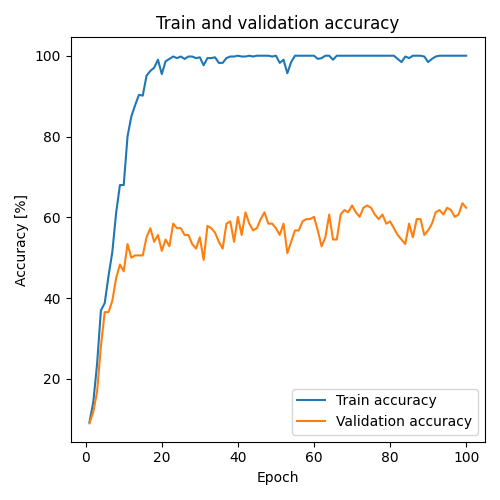
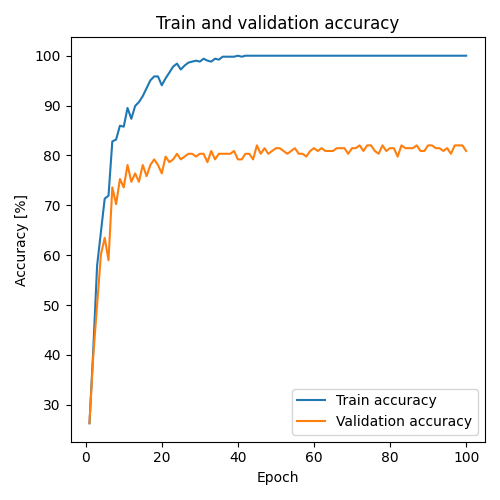
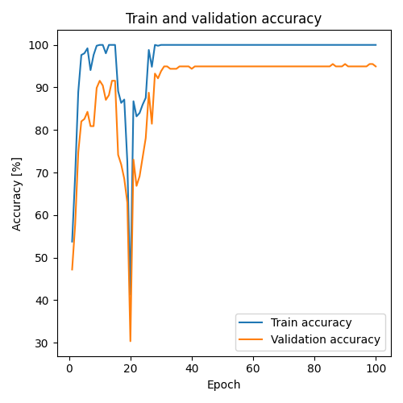
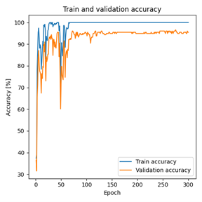
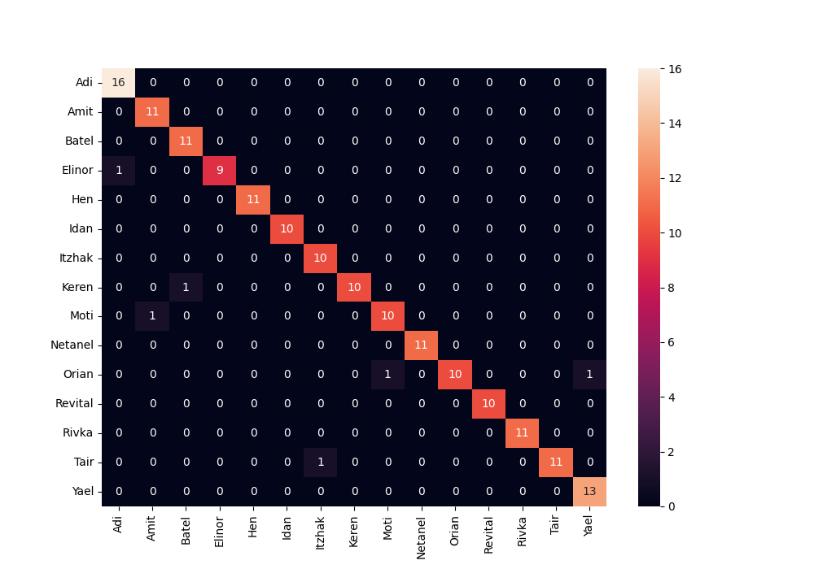

# Build New Dataset And Classify Faces By Using Transfer Learning
This is a class project as part of EE046211 - Deep Learning course @ Technion.  

<p align="center">
Batel Shuminov</a>  •  
Amit Kadosh</a>


## Introduction
Face classification is an important capability that can have a wide variety of uses. for example:
1. The system can be used to help blind people know who is at the front door of the house.
2. The system can also be integrated into the smart home field - automatic opening of the house door or simply reading the name of the person standing at the entrance to the house.
3. Creating personal albums - you can locate the photos in which a certain person appears and thus build a personal album for him easily.
This area was not tested due to the lack of a suitable dataset.
In addition, face classification is an individual problem of each person because each person knows different people and wants to classify them.
Therefore, we found it appropriate to prove the feasibility of implementing a system based on Deep Learning for the purpose of face classification for a group of people on which the model will be trusted.
The main difficulty expected in this project is that Deep Learning works well when there are many examples and in this project the number of examples is very few.
In order to overcome this difficulty, we will use transfer learning which was trained on another dataset for a different purpose.

## stam 
### Dataset
The dataset creation process consists of four steps.
- Step 1:Collect images for all the people we want to train the network on, and put them inside folders into a folder called Original dataset.
In our project we collected about 50 photos for 15 people.

- Step 2: Run the code responsible for processing the images and extracting faces from them:
  ``` preprocessing_dataset ```
And after that :
  ``` find_unrecognized_faces ```
After running the code we will get a folder named Dataset after preprocessing.

- Step 3: Manual filtering is performed to delete false identifications and face identifications of another person who appeared in the same photo. Move the relevant images to the Dataset after verify folder.

- Step 4: Divide the dataset into train, validation and test by running the following code:
  ``` split_verify_ds_to_train_val_test ```
And you get a new folder named Final dataset with the divided dataset.

### Training and test

After creating the dataset we run the following code after training the program and choosing the best model:
  ``` build_and_train_the_model ```
And then do a test with the code:
  ``` test_the_model ```

## Dataset
### Original Dataset
The name Original Dataset represents the original images loaded into the array before any processing.
The dataset for our project should contain images of some persons with different characteristics (for example, different situation, different lighting, different camera and more). There is no Dataset like this around the internet so we had to build it.
In order for this project to be able after further hardware development to be used by anyone, we need to require a relatively low minimum threshold of images for each person. Therefore, we chose to use 50 images for each person.
We built the dataset for this project from images from our personal smartphones and social networks. We collect data of 15 classes (different people) with each having only 50 images.
We will save the images in a folder called "Original Dataset" which contains 15 folders for each of the people we want to teach our model.


<p align="center">
Figure 1: Example of images from "Amit" class in "Original Dataset".

### Prepressing Dataset
#### Face Recognition
Now we will move to the second stage - the face recognition stage in the image.
We used a built-in algorithm in Python called Cascade Classifier from a GitHub project which is based on classic Machine Learning. This algorithm has been widely used in many web projects.
OpenCV uses machine learning algorithms to search for faces within a picture. For something like a face, might have 6,000 or more classifiers, all of which must match for a face to be detected (within error limits). the algorithm starts at the top left of a picture and moves down across small blocks of data, looking at each block, and check if is this a face. Since there are 6,000 or more tests per block, might have millions of calculations to do. To get around this, OpenCV uses cascades. The OpenCV cascade breaks the problem of detecting faces into multiple stages. For each block, it does a very rough and quick test. If that passes, it does a slightly more detailed test, and so on. The algorithm may have 30 to 50 of these stages or cascades, and it will only detect a face if all stages pass. The advantage is that the majority of the picture will return a negative during the first few stages, which means the algorithm won’t waste time testing all 6,000 features on it. Instead of taking hours, face detection can now be done in real time.
This algorithm works with grayscale images, so in order to run the algorithm, we first converted the images to grayscale.
After receiving the face location from the algorithm, we cut the face from the original color image. Finally, we resized it to 256x256 so that all the face photos would be the same size.


<p align="center">
Figure 2: Face Recognition. (a) The original image, (b) The image in gray scale, (c) Face recognition performed by the Cascade Classifier algorithm, (d) Cropping the face from original image and resize to 256x256.

  #### Improving Face Recognition Algorithm by Rotation
  Unfortunately, we noticed that the algorithm we described does not give good enough results - there are many images in which it fails to recognize faces. We delved into the images and found that the algorithm has more difficulty in images in which the faces are slightly rotated. In Figure 3 in the top row of images, you can see the result of the basic algorithm for the two images on the left - the algorithm did not find the face in both images. Following the importance of this algorithm in our case, in a situation where every image is important, we decided to improve the algorithm - we implemented a cyclic process to rotate the image by 15 degrees at each step. In Figure 3 in the bottom row of images, you can see the result after our improvement - the improved algorithm manages to recognize the face in both images. The improved algorithm provides about a 20% improvement in facial recognition. It's just a lot in this project.
  

<p align="center">
  Figure 3: (a) Original images, (b) Results of facial recognition algorithm – it can be seen that no faces are received in this case, (c) Results of  improved algorithmm – it can be seen that the new algorithm find the two faces in the image.
  
  ## Reference Model 
  ### Reference model architecture
  In order to see the effect of Transfer Learning and its contribution to improving the results in the case of a small dataset, we compared several Deep Learning models for image classification without using Transfer Learning at all.
In this article we will present the model with which we got the "best" results for this series of models (which does not use Transfer Learning).
This model is used as a starting point of reference for examining the contribution of Transfer Learning. Therefore, we will call this model the Reference Model.
The Reference Model is built in the standard way for image classification in Deep Learning where the first part has convolution layers and the second part fully connected layers. Of course, activation is also used to break the linearity and pooling to reduce the dimensions of the image, which will be explained in detail later.
The architecture of this model is shown in Figure 4.


<p align="center">
  Figure 4: The architecture of Reference Model.
  
  ### Results
  #### Reference Model
  The model we made yielded a result of 52.9412%, these results are little disappointing, but not so surprising, because it is 15 classes with very few images for training each class, and as we know Deep Learning works well when there is a lot of data. In figure 5 you can see the accuracy as function of epoch number during the training.


<p align="center">
  Figure 5: The accuracy of Reference Model on train and validation sets as function of epoch number during the training.

### Transfer Learning - Feature Extraction
First, we examined the case of Feature extraction, this    method    is    faster    and converges faster than Fine tuning, the results for this case can be seen in Table 1.


|model name         |train accuracy         |validation accuracy         |test accuracy         |
|----------------------|----------------------|----------------------|----------------------|
|resnet18|100.0000%|83.1461%|77.0588%|
|AlexNet|100.0000%|73.0337%|68.8235%|
|vgg16| 100.0000%|74.1573%|61.7647%|
|squeezenet1_0| 100.0000%|82.0225%|79.4118%| 
|densenet121| 100.0000%|81.4607%|75.2941%|

 <p align="center">
 Table 1: The results when using Transfer Learning in the case of Feature Extraction for 5 different architectures: resnet18, AlexNet, vgg16, squeezenet1_0, densent121. 

The improvement is very impressive - the best result was obtained from squeezenet1_0 and is 79.4118% on the Test. In Figure 6 you can see the accuracy as a function of the epoch number for squeezenet1_0.


<p align="center">
  Figure 6: The accuracy of squeezenet1_0 model on train and validation sets as function of epoch number during the training.

### Transfer Learning - Fine Tuning
We examined the training for the case of Fine Tuning. The results for this case can be seen in Table 2. We got a huge improvement of 14% from Feature extraction method, and a accuracy of 94.1176% on the test set for the ResNet18 architecture. These are already very impressive results.

|model name         |train accuracy         |validation accuracy         |test accuracy         |
|----------------------|----------------------|----------------------|----------------------|
|resnet18|100.0000%|95.5056%|94.1176%|
|AlexNet|Stuck on low percentages and does not release even with a different learning rate|
|vgg16| Out of Memory - Unable to train with our resources|
|squeezenet1_0| 99.2095%|61.2360%|52.9412%| 
|densenet121| 100.0000%|96.6292%|93.5294%|

 <p align="center">
 Table 2: The results when using Transfer Learning in the case of Fine Tuning for 5 different architectures: resnet18, AlexNet, vgg16, squeezenet1_0, densent121.   


We note that for the AlexNet architecture, we accepted that the model is stuck at low percentages and does not improve even when changing the learning rate, and for vgg16 architecture, we accepted that it can't train with our resources since it requires a lot of memory. In Figure 7 you can see the accuracy as a function of the epoch number for resnet18. 


<p align="center">
  Figure 7: The accuracy of resnet18 model on train and validation sets as function of epoch number during the training.
  
 ### Augmentation
We tested the augmentation described above on the best model - transfer learning with ResNet18 with fine tuning method.  In table 3 you can see the results for each case. It can be seen that only using RandomRotation augmentation improved the results from the situation where we did not use augmentation at all.

|Augmentation         |train accuracy         |validation accuracy         |test accuracy        |
|----------------------|----------------------|----------------------|----------------------|
|Random Rotation|100.0000%|96.6292%|96.4706%|
|Random Resized |94.6640%|91.0112%|80.5882%|
|Gaussian Noise| 100.0000%|96.6292%|92.9412%| 
|Normalize| 100.0000%|96.6292%|94.1176%|

<p align="center">
 Table 3: The results when using Augmentation for 4 different types: random rotation, random resize, gaussian noise, normalize, for the case of transfer learning with ResNet18 with fine tuning method.
 
 In Figure 8 you can see the accuracy as a function of the epoch number for ResNet18 with augmentation - random rotation.
 

<p align="center">
  Figure 8: The accuracy of resnet18 with fine tuning and random rotation augmentation on train and validation sets as function of epoch number during the training.
  
  We note that the number of epochs we did in the augmentation test is 300 compared to 100 when we tested the models.
In order to prove that the improvement is not obtained because of increasing the epochs but because of the augmentation, we retrain ResNet18 without augmentations, but this time for 300 epochs instead of 100.
In this situation we get accuracy of 92.9412% (even less good result than 100 epochs). Thus, we proved that the improvement does not increase because of a larger number of iterations but because of the use of augmentation.

### Best Model – Confusion Matrix.

In Figure 9 you can see the confusion matrix for this case.


<p align="center">
  Figure 9: Confusion matrix of resnet18 with fine tuning and random rotation augmentation.
  
  ## Conclusion
  
  In this project we will first improve a standard face recognition algorithm in Python which is based on classic ML by implementing a loop on this algorithm when each time the image in the input of the algorithm rotates by 15 degrees.
We created the dataset for this project ourselves from photos of family and friends. We collect 50 images per user for 15 people.
After that we tested a number of Deep Learning models and trained them on the dataset we collected. We have shown the correctness of the claim that Deep Leaning does not provide good results on a small dataset.
Later, we used Transfer Learning with two methods - Feature extraction and Fine tuning.
We tested 5 different architectures (resnet18, AlexNet, vgg16, squeezenet1_0, dense121) with both methods.
We compared the results and found the model that provided the best results on the test set.
In addition, we tested 4 common augmentations to improve the generalization of the algorithm.
In conclusion, the best model we found in this project was obtained using the ResNet18 architecture when we performed Transfer Learning using the Fine-Tuning method. We improved the model results by a few percent by using random rotation augmentation in the range of [-20,20] degrees. The final model yielded an accuracy of 96.4706% on the test set.


## Future Works
- 	In the first stage of face recognition in the image, it is possible to examine the use of deep learning in order to improve the recognition percentage of the algorithm. With this improvement, it will be possible to get a larger data set without the need to add images.
-   Additional architectures can be selected for Transfer Learning using both methods - Feature extraction and Fine Tuning.
-   Creating a GUI for loading images by the user and clear instructions for creating a model automatically for the user.
- 	Use of a camera for hardware implementation and examination of the model.

## References
- Implementing Face Recognition Using Deep Learning and Support Vector Machines: https://www.codemag.com/Article/2205081/Implementing-Face-Recognition-Using-Deep-Learning-and-Support-Vector-Machines
-	Face Recognition with Python, in Under 25 Lines of Code: https://realpython.com/face-recognition-with-python/
-	Attribute error while using opencv for face recognition: https://stackoverflow.com/questions/36242860/attribute-error-while-using-opencv-for-face-recognition
-	Basic Operations on Images: https://docs.opencv.org/4.5.3/d3/df2/tutorial_py_basic_ops.html#:%7E:text=making%20borders%20for%20images%20(padding)
-	2 ways to rotate an image by an angle in Python: https://www.askpython.com/python/examples/rotate-an-image-by-an-angle-in-python
-	Loading Dating without a separate TRAIN/TEST Directory - Pytorch (ImageFolder): https://discuss.pytorch.org/t/loading-dating-without-a-separate-train-test-directory-pytorch-imagefolder/130656
-	Intro-to-PyTorch- Loading Image Data: https://www.kaggle.com/code/leifuer/intro-to-pytorch-loading-image-data
-	Loss function — CrossEntropyLoss vs BCELoss in Pytorch: https://medium.com/dejunhuang/learning-day-57-practical-5-loss-function-crossentropyloss-vs-bceloss-in-pytorch-softmax-vs-bd866c8a0d23
-	SAVING AND LOADING MODELS: https://pytorch.org/tutorials/beginner/saving_loading_models.html
-	Error loading saved model: https://discuss.pytorch.org/t/error-loading-saved-model/8371/5
-	 SAVE AND LOAD THE MODEL:  https://pytorch.org/tutorials/beginner/basics/saveloadrun_tutorial.html
-	 How to resize an image with OpenCV2.0 and Python2.6:  https://stackoverflow.com/questions/4195453/how-to-resize-an-image-with-opencv2-0-and-python2-6
-	How to get pixel location in after rotating the image: https://datascience.stackexchange.com/questions/86402/how-to-get-pixel-location-in-after-rotating-the-image

  
