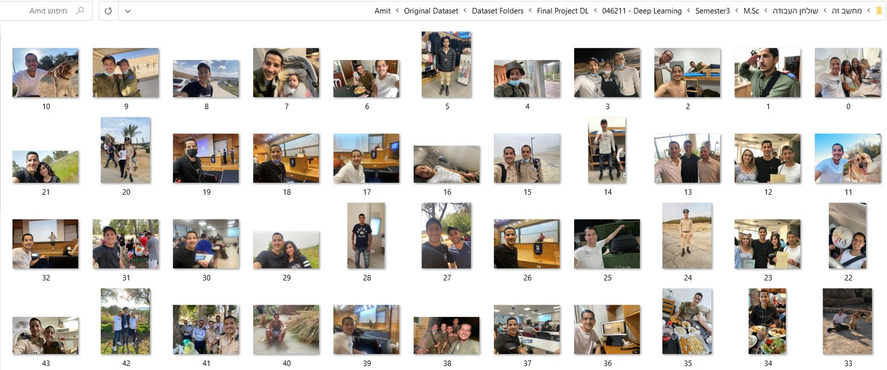
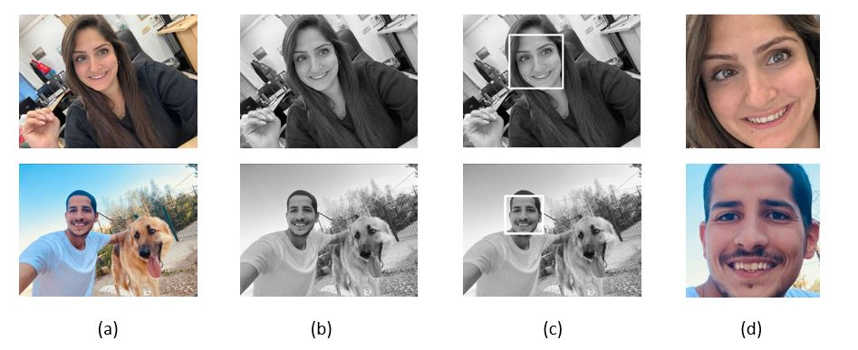
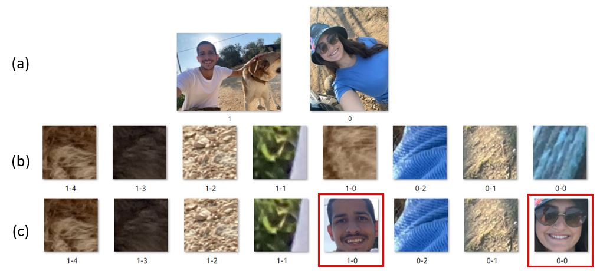
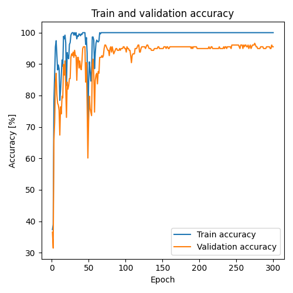
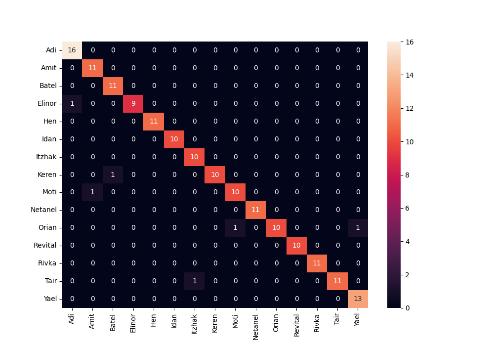

# Build New Dataset And Classify Faces By Using Transfer Learning
This is a class project as part of EE046211 - Deep Learning course @ Technion.  

<p align="center">
Batel Shuminov</a>  •  
Amit Kadosh</a>

  * [Files in The repository](#files-in-the-repository)
  * [Introduction](#introduction)
  * [Steps to run the project](#steps-to-run-the-project)
  * [Creating a Dataset](#creating-a-dataset) 
  * [Models](#models)
  * [Results](#results)
  * [Conclusion](#conclusion)
  * [Future Works](#future-works)
  * [Presentation](#presentation)
  * [References](#references)


## Files in the repository
|File name         | Purpsoe |
|----------------------|------|
|Code files|Folder that contain all code files in this project|
|Code files\preprocessing_dataset.py|This code pass throw "Original Dataset" folder and recognized faces from images in this folder. All the face images save in "Dataset after preprocessing" folder in the same order.|
|Code files\find_unrecognized_faces.py|This code can only be run after building the "Dataset after verify" folder as will be explained in a separate chapter on this page. This code compares the names of the files in the "Dataset after verify" folder and the original images folder "Original Dataset" and creates a text file inside the "Dataset Folder" folder that contains the names of all the files from which the algorithm did not detect a face.|
|Code files\split_verify_ds_to_train_val_test.py|This code divides the images in the "Dataset after verify" folder into train, validation and test and saves them in a new structure in "Final dataset" folder.|
|Code files\build_and_train_the_model.py|This code builds the model, trains it and also runs the following code ("test the model.py"). As will be explained below, the user can choose whether to use the "Reference Model" or to use Transfer Learning in one of two methods: "Feature Extraction" and "Fine Tuning". The Transfer Learning function in the code allows you to use one of 5 different architectures.|
|Code files\test_the_model.py| This code calculate the results of the model trained on the test set, saves the accuracy percentages to a text file and saves an image of the confusion matrix.|
|Dataset after verify.zip| This folder contains the face images in our project, after filtering from the "Dataset after preprocessing" folder as will be explained later.|
|Final dataset.zip| This folder contains the final dataset in our project. You can download this dataset in order to experiment with the system as you create a dataset that is suitable for you.|
|Final Report.pdf| Final Report|
|Images for README.md file| Images used for preview in README.md file|

## Introduction
Face recognition and classification is an important capability that can have a wide variety of uses. For example, in a smart home, helping the blind, building personal albums and more.
In this project we will first improve a standard face recognition algorithm in Python which is based on classic ML and then we will train a deep learning model for the purpose of classify the face in the image into one of the 15 people on which the model was trained.
During the project we examined the use of Transfer Learning using two methods - Feature extraction and Fine tuning.
For the purpose of improving the generalization of the model, we used augmentations of various types.

## How to run this project?
###stage 1 - Create the dataste:
- Create a main folder for the project named as you wish. For the purpose of the example we will use the name "Final Project".

- Create a folder named "Dataset Folders" inside the "Final Project" folder. In "Dataset Folders" folder, create a folder named "Original Dataset". 

-  Collect at least images for all the people you want to train the network on, and put them inside "Original Dataset" folder.
It is recommended to collect at least 50 photos for each person, but the system is expected to give good accuracy percentages even with less.

- Download the "Code files" folder into the "Final Project" folder.

- Run the code "preprocessing_dataset.py". Inside the folder "Dataset Folders" a folder named "Dataset after preprocessing" will be created.

- Duplicate the "Dataset after preprocessing" folder and rename the new folder to "Dataset after verify".

- Perform a manual filter for the images in the "Dataset after verify" folder - delete all the images that are not faces and also the images that are not the faces of the same person registered in the name of the class.

- Run the code "split_verify_ds_to_train_val_test". Inside the folder "Dataset Folders" a folder named "Final dataset" will be created.

The dataset creation process can be seen in the [next section](#creating-a-dataset).

###stage 2 - Train and test the model:


### Train and test the model

After creating the dataset we run the following code after training the program and choosing the best model:
  ``` build_and_train_the_model ```
And then do a test with the code:
  ``` test_the_model ```

## Creating a Dataset
### Original Dataset
The name Original Dataset represents the original images loaded into the array before any processing.
The dataset for our project should contain images of some persons with different characteristics (for example, different situation, different lighting, different camera and more).
In order for this project to be able after further hardware development to be used by anyone, we need to require a relatively low minimum threshold of images for each person. Therefore, we chose to use 50 images for each person.
We built the dataset for this project from images from our personal smartphones and social networks. We collect data of 15 classes (different people) with each having only 50 images.
We will save the images in a folder called "Original Dataset" which contains 15 folders for each of the people we want to teach our model.


<p align="center">
Figure 1: Example of images from "Amit" class in "Original Dataset".

### Prepressing Dataset
#### Face Recognition
For facial recognition we used a built-in algorithm in Python called Cascade Classifier from a GitHub project which is based on classic Machine Learning. This algorithm works with grayscale images, so in order to run the algorithm, we first converted the images to grayscale. After receiving the face location from the algorithm, we cut the face from the original color image. Finally, we resized it to 256x256 so that all the face photos would be the same size.



<p align="center">
Figure 2: Face Recognition. (a) The original image, (b) The image in gray scale, (c) Face recognition performed by the Cascade Classifier algorithm, (d) Cropping the face from original image and resize to 256x256.

  #### Improving Face Recognition Algorithm by Rotation
  Unfortunately, we noticed that the algorithm we described does not give good enough results - there are many images in which it fails to recognize faces. We delved into the images and found that the algorithm has more difficulty in images in which the faces are slightly rotated. In Figure 3 in the top row of images, you can see the result of the basic algorithm for the two images on the left - the algorithm did not find the face in both images. Following the importance of this algorithm in our case, in a situation where every image is important, we decided to improve the algorithm - we implemented a cyclic process to rotate the image by 15 degrees at each step. In Figure 3 in the bottom row of images, you can see the result after our improvement - the improved algorithm manages to recognize the face in both images. The improved algorithm provides about a 20% improvement in facial recognition.  

<p align="center">
  Figure 3: (a) Original images, (b) Results of facial recognition algorithm – it can be seen that no faces are received in this case, (c) Results of  improved algorithmm – it can be seen that the new algorithm find the two faces in the image.
  
  ## Models 
  We performed an examination on several models:
- In the first stage we built a model where the first part has convolution layers and the second part fully connected layers. Of course, activation layers are also used to break the linearity and pooling layers to reduce the dimensions of the image.
- Then we used transfer learning with two methods: Feature Extraction and Fine Tuning. When we examined the architectures: resnet18, AlexNet, vgg16, squeezenet1_0 and dense121.
  
## Results
  ### Reference Model
  The model we made yielded a result of 52.9412%, these results are little disappointing, but not so surprising, because it is 15 classes with very few images for training each class, and as we know Deep Learning works well when there is a lot of data. 


### Transfer Learning - Feature Extraction
First, we examined the case of Feature extraction, this    method    is    faster    and converges faster than Fine tuning, the results for this case can be seen in Table 1.


|model name         |train accuracy         |validation accuracy         |test accuracy         |
|----------------------|----------------------|----------------------|----------------------|
|resnet18|100.0000%|83.1461%|77.0588%|
|AlexNet|100.0000%|73.0337%|68.8235%|
|vgg16| 100.0000%|74.1573%|61.7647%|
|squeezenet1_0| 100.0000%|82.0225%|79.4118%| 
|densenet121| 100.0000%|81.4607%|75.2941%|

 <p align="center">
 Table 1: The results when using Transfer Learning in the case of Feature Extraction for 5 different architectures: resnet18, AlexNet, vgg16, squeezenet1_0, densent121. 

The improvement is very impressive - the best result was obtained from squeezenet1_0 and is 79.4118% on the Test.

### Transfer Learning - Fine Tuning
We examined the training for the case of Fine Tuning. The results for this case can be seen in Table 2. We got a huge improvement of 14% from Feature extraction method, and a accuracy of 94.1176% on the test set for the ResNet18 architecture. These are already very impressive results.

|model name         |train accuracy         |validation accuracy         |test accuracy         |
|----------------------|----------------------|----------------------|----------------------|
|resnet18|100.0000%|95.5056%|94.1176%|
|AlexNet|Stuck on low percentages and does not release even with a different learning rate|
|vgg16| Out of Memory - Unable to train with our resources|
|squeezenet1_0| 99.2095%|61.2360%|52.9412%| 
|densenet121| 100.0000%|96.6292%|93.5294%|

 <p align="center">
 Table 2: The results when using Transfer Learning in the case of Fine Tuning for 5 different architectures: resnet18, AlexNet, vgg16, squeezenet1_0, densent121.   


We note that for the AlexNet architecture, we accepted that the model is stuck at low percentages and does not improve even when changing the learning rate, and for vgg16 architecture, we accepted that it can't train with our resources since it requires a lot of memory.


  
 ### Augmentation
We tested the augmentation described above on the best model - transfer learning with ResNet18 with fine tuning method.  In table 3 you can see the results for each case. It can be seen that only using RandomRotation augmentation improved the results from the situation where we did not use augmentation at all.

|Augmentation         |train accuracy         |validation accuracy         |test accuracy        |
|----------------------|----------------------|----------------------|----------------------|
|Random Rotation|100.0000%|96.6292%|96.4706%|
|Random Resized |94.6640%|91.0112%|80.5882%|
|Gaussian Noise| 100.0000%|96.6292%|92.9412%| 
|Normalize| 100.0000%|96.6292%|94.1176%|

<p align="center">
 Table 3: The results when using Augmentation for 4 different types: random rotation, random resize, gaussian noise, normalize, for the case of transfer learning with ResNet18 with fine tuning method.
 
 In Figure 4 you can see the accuracy as a function of the epoch number for ResNet18 with augmentation - random rotation.
 

<p align="center">
  Figure 4: The accuracy of resnet18 with fine tuning and random rotation augmentation on train and validation sets as function of epoch number during the training.
  
  We note that the number of epochs we did in the augmentation test is 300 compared to 100 when we tested the models.
In order to prove that the improvement is not obtained because of increasing the epochs but because of the augmentation, we retrain ResNet18 without augmentations, but this time for 300 epochs instead of 100.
In this situation we get accuracy of 92.9412% (even less good result than 100 epochs). Thus, we proved that the improvement does not increase because of a larger number of iterations but because of the use of augmentation.

### Best Model – Confusion Matrix.

In Figure 5 you can see the confusion matrix for this case.


<p align="center">
  Figure 5: Confusion matrix of resnet18 with fine tuning and random rotation augmentation.
  
## Conclusion
  
  In this project we will first improve a standard face recognition algorithm in Python which is based on classic ML by implementing a loop on this algorithm when each time the image in the input of the algorithm rotates by 15 degrees.
We created the dataset for this project ourselves from photos of family and friends. We collect 50 images per user for 15 people.
After that we tested a number of Deep Learning models and trained them on the dataset we collected. We have shown the correctness of the claim that Deep Leaning does not provide good results on a small dataset.
Later, we used Transfer Learning with two methods - Feature extraction and Fine tuning.
We tested 5 different architectures (resnet18, AlexNet, vgg16, squeezenet1_0, dense121) with both methods.
We compared the results and found the model that provided the best results on the test set.
In addition, we tested 4 common augmentations to improve the generalization of the algorithm.
In conclusion, the best model we found in this project was obtained using the ResNet18 architecture when we performed Transfer Learning using the Fine-Tuning method. We improved the model results by a few percent by using random rotation augmentation in the range of [-20,20] degrees. The final model yielded an accuracy of 96.4706% on the test set.


## Future Works
- 	In the first stage of face recognition in the image, it is possible to examine the use of deep learning in order to improve the recognition percentage of the algorithm. With this improvement, it will be possible to get a larger data set without the need to add images.
-   Additional architectures can be selected for Transfer Learning using both methods - Feature extraction and Fine Tuning.
-   Creating a GUI for loading images by the user and clear instructions for creating a model automatically for the user.
- 	Use of a camera for hardware implementation and examination of the model.
    
## Presentation
- [Recording](https://youtu.be/kuYXh3wELr0) of in-class project presentation (Hebrew only)

    

## References
- Implementing Face Recognition Using Deep Learning and Support Vector Machines: https://www.codemag.com/Article/2205081/Implementing-Face-Recognition-Using-Deep-Learning-and-Support-Vector-Machines
-	Face Recognition with Python, in Under 25 Lines of Code: https://realpython.com/face-recognition-with-python/
-	Attribute error while using opencv for face recognition: https://stackoverflow.com/questions/36242860/attribute-error-while-using-opencv-for-face-recognition
-	Basic Operations on Images: https://docs.opencv.org/4.5.3/d3/df2/tutorial_py_basic_ops.html#:%7E:text=making%20borders%20for%20images%20(padding)
-	2 ways to rotate an image by an angle in Python: https://www.askpython.com/python/examples/rotate-an-image-by-an-angle-in-python
-	Loading Dating without a separate TRAIN/TEST Directory - Pytorch (ImageFolder): https://discuss.pytorch.org/t/loading-dating-without-a-separate-train-test-directory-pytorch-imagefolder/130656
-	Intro-to-PyTorch- Loading Image Data: https://www.kaggle.com/code/leifuer/intro-to-pytorch-loading-image-data
-	Loss function — CrossEntropyLoss vs BCELoss in Pytorch: https://medium.com/dejunhuang/learning-day-57-practical-5-loss-function-crossentropyloss-vs-bceloss-in-pytorch-softmax-vs-bd866c8a0d23
-	SAVING AND LOADING MODELS: https://pytorch.org/tutorials/beginner/saving_loading_models.html
-	Error loading saved model: https://discuss.pytorch.org/t/error-loading-saved-model/8371/5
-	 SAVE AND LOAD THE MODEL:  https://pytorch.org/tutorials/beginner/basics/saveloadrun_tutorial.html
-	 How to resize an image with OpenCV2.0 and Python2.6:  https://stackoverflow.com/questions/4195453/how-to-resize-an-image-with-opencv2-0-and-python2-6
-	How to get pixel location in after rotating the image: https://datascience.stackexchange.com/questions/86402/how-to-get-pixel-location-in-after-rotating-the-image

  
