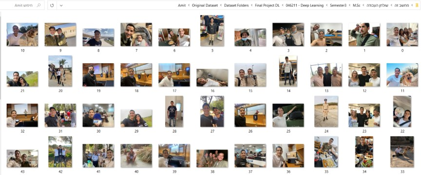
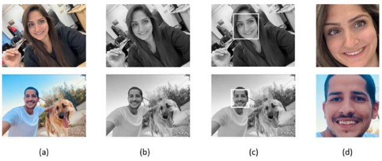
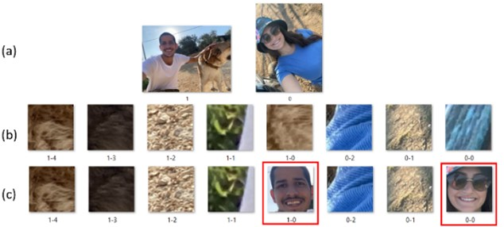
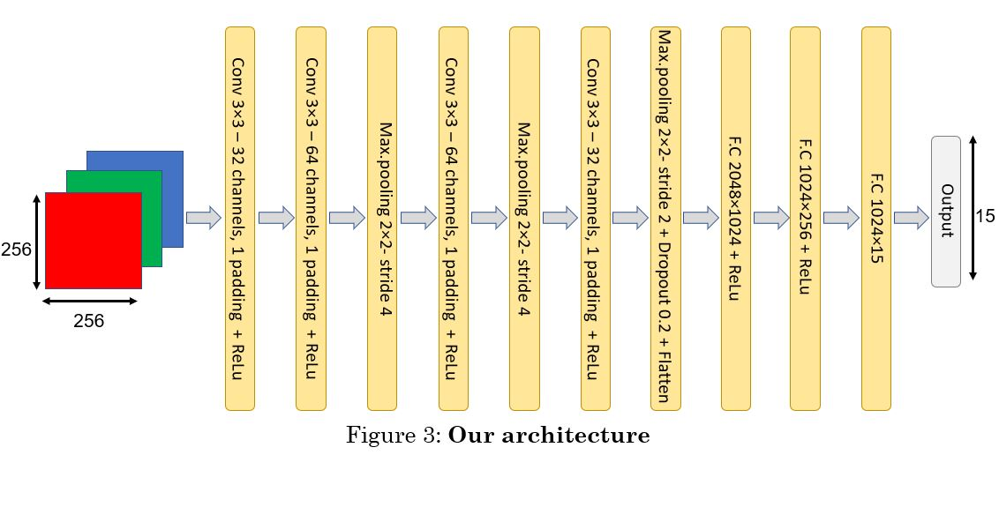

# Build NewnDataset And Classify Faces By Using Transfer Learning
This is a class project as part of EE046211 - Deep Learning course @ Technion.  

Batel Shuminov</a>  •  
Amit Kadosh</a>

## Introduction
Face classification is an important capability that can have a wide variety of uses. for example:
1. The system can be used to help blind people know who is at the front door of the house.
2. The system can also be integrated into the smart home field - automatic opening of the house door or simply reading the name of the person standing at the entrance to the house.
3. Creating personal albums - you can locate the photos in which a certain person appears and thus build a personal album for him easily.
This area was not tested due to the lack of a suitable dataset.
In addition, face classification is an individual problem of each person because each person knows different people and wants to classify them.
Therefore, we found it appropriate to prove the feasibility of implementing a system based on Deep Learning for the purpose of face classification for a group of people on which the model will be trusted.
The main difficulty expected in this project is that Deep Learning works well when there are many examples and in this project the number of examples is very few.
In order to overcome this difficulty, we will use transfer learning which was trained on another dataset for a different purpose.

## Dataset
### Original Dataset
The name Original Dataset represents the original images loaded into the array before any processing.
The dataset for our project should contain images of some persons with different characteristics (for example, different situation, different lighting, different camera and more). There is no Dataset like this around the internet so we had to build it.
In order for this project to be able after further hardware development to be used by anyone, we need to require a relatively low minimum threshold of images for each person. Therefore, we chose to use 50 images for each person.
We built the dataset for this project from images from our personal smartphones and social networks. We collect data of 15 classes (different people) with each having only 50 images.
We will save the images in a folder called "Original Dataset" which contains 15 folders for each of the people we want to teach our model.

Figure 1: Example of images from "Amit" class in "Original Dataset".

### Prepressing Dataset
#### Face Recognition
Now we will move to the second stage - the face recognition stage in the image.
We used a built-in algorithm in Python called Cascade Classifier from a GitHub project which is based on classic Machine Learning. This algorithm has been widely used in many web projects.
OpenCV uses machine learning algorithms to search for faces within a picture. For something like a face, might have 6,000 or more classifiers, all of which must match for a face to be detected (within error limits). the algorithm starts at the top left of a picture and moves down across small blocks of data, looking at each block, and check if is this a face. Since there are 6,000 or more tests per block, might have millions of calculations to do. To get around this, OpenCV uses cascades. The OpenCV cascade breaks the problem of detecting faces into multiple stages. For each block, it does a very rough and quick test. If that passes, it does a slightly more detailed test, and so on. The algorithm may have 30 to 50 of these stages or cascades, and it will only detect a face if all stages pass. The advantage is that the majority of the picture will return a negative during the first few stages, which means the algorithm won’t waste time testing all 6,000 features on it. Instead of taking hours, face detection can now be done in real time.
This algorithm works with grayscale images, so in order to run the algorithm, we first converted the images to grayscale.
After receiving the face location from the algorithm, we cut the face from the original color image. Finally, we resized it to 256x256 so that all the face photos would be the same size.

Figure 2: Face Recognition. (a) The original image, (b) The image in gray scale, (c) Face recognition performed by the Cascade Classifier algorithm, (d) Cropping the face from original image and resize to 256x256.

  #### Improving Face Recognition Algorithm by Rotation
  Unfortunately, we noticed that the algorithm we described does not give good enough results - there are many images in which it fails to recognize faces. We delved into the images and found that the algorithm has more difficulty in images in which the faces are slightly rotated. In Figure 3 in the top row of images, you can see the result of the basic algorithm for the two images on the left - the algorithm did not find the face in both images. Following the importance of this algorithm in our case, in a situation where every image is important, we decided to improve the algorithm - we implemented a cyclic process to rotate the image by 15 degrees at each step. In Figure 3 in the bottom row of images, you can see the result after our improvement - the improved algorithm manages to recognize the face in both images. The improved algorithm provides about a 20% improvement in facial recognition. It's just a lot in this project.
  
 

  Figure 3: (a) Original images, (b) Results of facial recognition algorithm – it can be seen that no faces are received in this case, (c) Results of  improved algorithmm – it can be seen that the new algorithm find the two faces in the image.
  
  ## Reference Model 
  ### Reference model architecture
  In order to see the effect of Transfer Learning and its contribution to improving the results in the case of a small dataset, we compared several Deep Learning models for image classification without using Transfer Learning at all.
In this article we will present the model with which we got the "best" results for this series of models (which does not use Transfer Learning).
This model is used as a starting point of reference for examining the contribution of Transfer Learning. Therefore, we will call this model the Reference Model.
The Reference Model is built in the standard way for image classification in Deep Learning where the first part has convolution layers and the second part fully connected layers. Of course, activation is also used to break the linearity and pooling to reduce the dimensions of the image, which will be explained in detail later.
The architecture of this model is shown in Figure 4.

  

  Figure 4: The architecture of Reference Model.
  
  ### Activation, Dropout and Pooling 
  -	#### Activation Function
  The key change made to the Perceptron that brought upon the era of deep learning is the addition of activation functions to the output of each neuron. These allow the learning of non-linear functions.
In reference model we used ReLU (Rectified Linear Unit) activation functions.
It is the most common activation function as it is fast to compute and does not bound the output (which helps with some issues during Gradient Descent).
  - #### Dropout layer
The dropout layer is a regularization technique that is commonly used in deep learning to prevent overfitting. It works by randomly "dropping out" (setting to zero) a certain fraction of the neurons during each forward pass. This means that a certain percentage of the neurons in the layer will not be activated and will not contribute to the output during training. The dropout probability is a hyperparameter that is set before training, and it determines the fraction of neurons that will be dropped out. In the reference model, the dropout probability is set to 0.2, which means that 20% of the neurons in the dropout layer will be dropped out during each forward pass. The dropout layer is usually used after the convolutional layers and before the fully connected layers, as it is more effective in preventing overfitting in these layers.
- #### Pooling
Pooling is a sliding window type technique, but instead of applying weights, which can be trained, it applies a statistical function of some type over the contents of its window.
The most common type of pooling is called max pooling, and it applies the   function over the contents of the window.
To understand the contribute of Pooling to generalization, let’s imagine the case where we have convolutional filters that, during training, learn to detect the digit “9” in various orientations within the input images. In order for the CNN to learn to classify the appearance of “9” in the image correctly, it needs to in some way “activate” whenever a “9” is found anywhere in the image, no matter what the size or orientation the digit is (except for when it looks like “6”, that is). 
Pooling can assist with this higher level, generalized feature selection.
  
 
   

